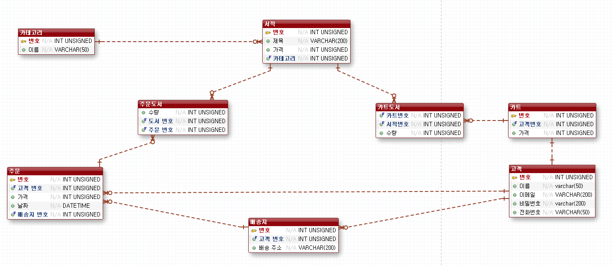
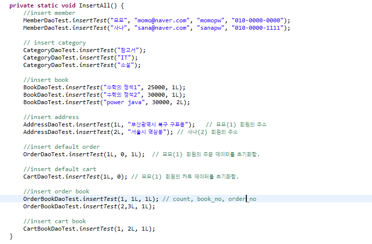
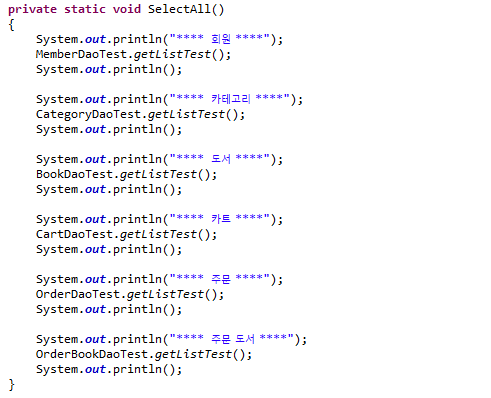
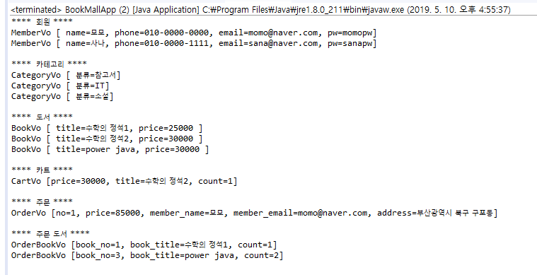

# bookMall :shopping_cart:

### insert 순서

1. - 고객 [ member ]
   - 카테고리 [ category ]
2. - 서적 [ book ]
   - 배송지 [ addresses ]
3. - 주문 [ orders ]
   - 카트 [ cart ]
4. - 주문 도서 [ order_book ]
   - 카트 도서 [ cart_book ]

:pushpin: `src/BookMallApp.java` 파일을 run하면, insert 와 select 를 수행 합니다.

---

### BookMall.java

#### insert 실행 함수

#### select 실행 함수

#### 실행 결과

